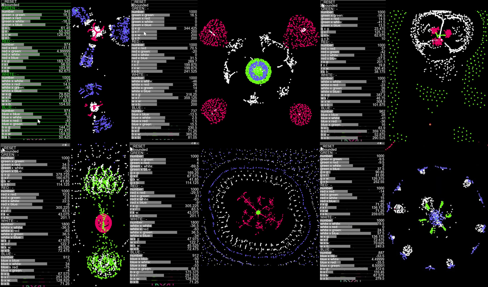

# Simulação de Vida de Partículas
Um programa simples para simular Vida Artificial primitiva usando regras simples de atração ou repulsão entre partículas semelhantes a átomos, produzindo padrões complexos de auto-organização semelhantes à vida. Excluindo os elementos da GUI, o código tem menos de uma página.

Demo online (versão JavaScript):
-------------
ariano-b.github.io/Vida-Particula/particle_life.html

Exemplos de resultados
--------------------------------------------------------

Alguns Padrões Interessantes para Reproduzir:
-------------------------------------
Você não precisa ser exato com os parâmetros para reproduzir esses padrões. A melhor maneira de obter padrões interessantes é primeiro tentar explorações aleatórias de parâmetros, uma vez que você encontrar um padrão interessante, tente ajustá-lo gradualmente. Para evitar ficar preso em um máximo local, você pode fazer alguns saltos ocasionais de parâmetros grandes. Desta forma, padrões interessantes e diferentes continuarão surgindo.

Para usar:
------------
Baixe este repositório. Descompacte o arquivo e vá para a pasta e clique em particle_life.html e abra no navegador de sua preferencia

Tópicos relacionados:
--------------------
Simulação de vida de partículas,
Sopa primordial - Evolução,
Jogo da vida de Conway,
Autômatos celulares,
Padrões de auto-organização,

Este projeto foi inspirado por: Clusters de Jeffery Ventrella http://www.ventrella.com/Clusters/. Não tenho acesso ao código de Ventrella, mas acho que a principal diferença deste projeto em relação aos outros projetos de vida de partículas é que não implementei a detecção de colisão e isso tornou possível simular milhares de partículas em tempo real. Além disso, adicionei controles de GUI para alterar os parâmetros em tempo real, permitindo fácil ajuste fino e exploração, portanto, consegui encontrar alguns padrões nunca vistos antes emergindo de alguns modelos extremamente simples de relações.
O código aqui é provavelmente uma ordem de magnitude mais simples do que qualquer outro código de vida artificial por aí, porque comecei este código apenas como um material educacional para não programadores e o público em geral para provar o ponto de que a complexidade pode surgir da simplicidade.

Codigo original feito por https://github.com/hunar4321
Modificações e tradução por Ariano Batista
